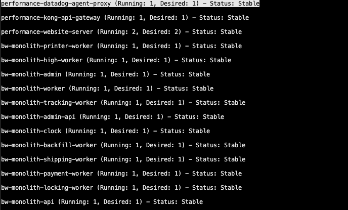
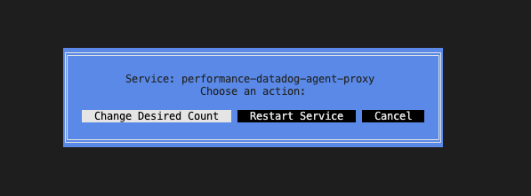

# bw-cli - ECS Service Scaling Tool

bw-cli -env [AWS-VAULT Profile] (aws-vault ls)
bw-cli -env bwperf

Press 'R' (Capital) to restart all services (Force deployments)

Enter a service to either 'Change Desired Count', 'Restart Service'.

## bw-cli is a simple CLI tool that allows users to view and modify the desired count of ECS services running in different clusters. The tool leverages the AWS CLI and aws-vault to manage credentials securely, and it provides an interactive, terminal-based user interface built with tview.

### Installation - Using Homebrew
brew tap alexalbu001/bw-cli
brew install bw-cli

## Prerequisites
To run bw-cli, you will need the following installed on your machine:

Go: Install Go (version 1.18 or above).
AWS CLI: Install AWS CLI.
aws-vault: Install aws-vault for managing AWS credentials.

### Testing - WIP